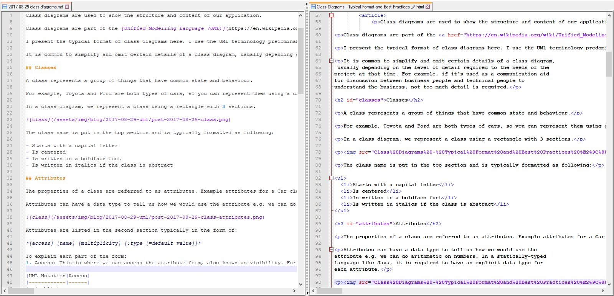
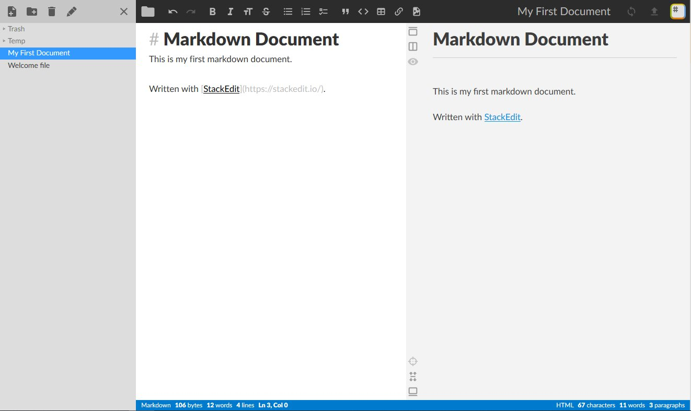

# Markdown

1. [What is it?](#what-is-it)
1. [Why use it?](#why-use-it)
1. [Standard](#standard)
1. [What do I use to create documents?](#what-do-i-use-to-create-documents)
1. [Syntax](#syntax)
1. [Extended Syntax](#extended-syntax)
1. [Applications](#applications)


## What is it?

Markdown is a minimal [markup langauge](https://en.wikipedia.org/wiki/Markup_language) to produce documents for the internet. Documents have a *.md* or *.markdown* file extension.

In 2004, John Gruber wrote and released the informal specification for Markdown. The motivation was to create a more eloquent alternative to writing in HTML. It becomes tedious adding tags to *mark* every piece of content when writing a HTML document. Markdown has a simpler and more succinct syntax, which makes it easier to write. 

Below, you can see a blog post, written in markdown on the left, and the generated HTML output on the right. Which would you prefer to write?



Markdown is not a replacement for HTML, it is there to empower people to write content without the larger formatting overhead of HTML, so it is used most often for content like blog posts.  Web Browsers do not understand a markdown document, so we still need to produce a HTML document from our markdown document. 

### Philosophy

- Easy to write
- Easy to read
- Can be published as-is on the internet

>*The overriding design goal for Markdown’s formatting syntax is to make it as readable as possible. The idea is that a Markdown-formatted document should be publishable as-is, as plain text, without looking like it’s been marked up with tags or formatting instructions.* **- John Gruber**

## Why use it?

### It's widely used

It's become widely used for formatting messages on popular apps such as: Facebook, Whatsapp, and Slack.

It's become widely used in forums, wikis, and comment sections on popular websites such as: Reddit, Stack Overflow, OpenStreetMap, Github, and Wikipedia.

It is used for building websites and blogs in tools like: Jekyll, Hugo, Github Pages, Squarespace, and others.

### Easy to learn

The syntax is short and simple to use. It is not that much different than plain text.

### Easy to convert to other formats

There are many different applications available to convert markdown to HTML and other formats reliably. 

### Use any text editor

Any text editor can be used to write a markdown document.

### Portable format

It is a plain text format and is not tied to particular Operating System or application.

## Standard

In 2004, John Gruber wrote and released an informal specification with his [syntax description](https://daringfireball.net/projects/markdown/syntax) and a Perl script (*Markdown.pl*). The idea was that the markdown source file is parsed by the script and transformed into a HTML file to be published online. These served as an informal standard.

### Standardization

Markdown has been widely embraced and adopted. However, the initial specification of Markdown contained ambiguities and unanswered questions, and the script had a few bugs. It recieved some criticism for these shortcomings. This led to implementations having differences, and adding extra features implemented in different ways. 

There were a few efforts to standardize implementations and form an official standard, but none proved successful. In 2012, a group began an organised effort to form an official standard, John Gruber objected to their plans, and eventually it became an alternative specification called [CommonMark](https://commonmark.org/).

### Variant Specifications

- [CommonMark](https://commonmark.org/): A strongly defined, highly compatible specification of Markdown.
- [GitHub Flavored Markdown (GFM)](https://github.com/gfm): It is based on CommonMark, and supports syntax extensions such as: tables, task lists, autolinking, and strikethrough. It supports some specific features to Github such as mentions.
- [Markdown Extra](https://michelf.ca/projects/php-markdown/extra/): This is an extension of markdown originally written in PHP but ported to other languages. It implements it's own specific set of amendments and extensions including: markdown inside HTML, definition lists, abbreviations, and footnotes. 


## What do I use to create documents?

To write a document you can use a simple text editor, such as notepad that comes with Windows. You need a more specialised editor to view the output, and convert the markdown file to other formats.

To be able to view the output, editors typically give you a live preview pane like *StackEdit* in the picture below. Most applications give you the option to export it as to other formats, HTML and PDF are the most common options. 



You can read the [Applications section](#applications) if you want help to pick an application for your needs. 

## Syntax

Mostly Markdown is just plain text with a few special non-alphabetic characters such as \*, these mark that piece of text to be transformed, becoming some element in the HTML output.

### Paragraph

A paragraph is simply one or more consecutive lines of text, separated by one or more blank lines. 

### Headings

	# This is a Heading Level 1 (<h1>)
	## This is a Heading Level 2 (<h2>)
	### This is a Heading Level 3 (<h3>)
	#### This is a Heading Level 4 (<h4>)
	##### This is a Heading Level 5 (<h5>)
	###### This is a Heading Level 6 (<h6>)

To create a heading, add hashes in front of a word or phrase. The number of hashes corresponds to the heading level.

Alternative: you can use `==` for heading 1, `--` for heading 2. 


### Emphasis

	*This text will be italic*
	_This will also be italic_
	
	**This text will be bold**
	__This will also be bold__
	
	_You **can** combine them_

Asterisks are preferred over underscores.

### Lists

#### Unordered List

	* Apple
	* Orange

Add an asterisk in front of line items. 

To create a nested list, indent the list item by 4 spaces or a tab.

	* Apple
	* Orange
	* Grape
		* Sauvignon White
		* Calabrese Red

Alternative: You can use a plus sign (\+) or hyphen (\-) instead of an asterisk. You can also use these interchangeably.

#### Ordered List

	1. Ireland
	1. United Kingdom

To create an ordered list, precede an item with a number followed by a dot. The numbers don’t have to be in numerical order, but the list should start with the number one.

To create a nested list, indent the list item by 4 spaces or a tab.

	1. Ireland
	1. United Kingdom
		1. Northern Ireland
		1. England
		1. Wales
		1. Scotland

### Images

	

Format: *``*


### Links

	[Github](http://github.com)

Format: *`[link text\]\(url\)`*

#### Adding a title

To add a title, enclose it in parentheses after the URL.

	

### Shortcut style

Markdown supports a shortcut style for creating “automatic” links for URLs and email addresses: simply surround the URL or email address with angle brackets. 

Markdown will turn this markdown: `<http://example.com/>` into this HTML: `<a href="http://example.com/">http://example.com/</a>`.

### Reference style

Reference-style links are there to improve readability. They separate URLs from a paragraph to a different location in the document. 

They are constructed in two parts: 

1. the text part you keep inline with your text

   format: `[link text][label]`
   
1. the URL part you store separately somewhere in the file.

	format: `[label]: URL "title"`

For example:


	If you want to learn markdown, you cannot go wrong by reading [this tutorial][1]. Happy learning!
	
	[1]: https://github.com/robole/markdown-reference "Markdown Reference Repository"

The first part has a label in the second set of brackets, which you define yourself. It is not case sensitive and can include letters, numbers, spaces, or punctuation.

The second part has the label in the first set of brackets, which should match the label from the first part. A title for the link can be enclosed in double quotes, single quotes, or parentheses after the URL.

You can place the second part of the link anywhere in the document. It is a matter of preference. Some people place them immediately after the paragraph in which they appear; while other people place them at the end of the document.


### Blockquotes

	> We're living the future so the present is our past. - Kanye West

becomes this:

> We're living the future so the present is our past. - Kanye West

### Code

Inline code is surrounded by backticks:

  \`html\` is the root of all good:

  becomes this: 

`<html>` is the root of all good.
	
Code blocks are indented by 4 spaces or a tab.

### Horizontal Rule

A horizontal rule is a line across the width of the page delineating the end of a section. You can produce a horizontal rule (`<hr/>`) by placing three or more hyphens, asterisks, or underscores on a line by themselves. If you wish, you may use spaces between the hyphens or asterisks.

	* * *
	
	***
	
	*****
	
	- - -
	
	---------------------------------------


### Inline HTML

For any markup that is not covered by Markdown’s syntax, you can simply use HTML itself. 

### Backslash Escapes

You can use backslash escapes so that you show the special markdown characters as text in your output. 

By writing this: `\*` in the source, we can see this: \* in the output .

Markdown provides backslash escapes for the following characters:

	\   backslash
	`   backtick
	*   asterisk
	_   underscore
	{}  curly braces
	[]  square brackets
	()  parentheses
	#   hash mark
	+   plus sign
	-   minus sign (hyphen)
	.   dot
	!   exclamation mark

## Extended Syntax

### Tables

You can create tables by using 3 or more hyphens (---) to create each column header, and by using pipes (|) to separate each column. 

	First Header | Second Header
	------------ | -------------
	Content from cell 1 | Content from cell 2
	Content in the first column | Content in the second column

becomes this:

First Header | Second Header
------------ | -------------
Content from cell 1 | Content from cell 2
Content in the first column | Content in the second column

Formatting of the content within tables is limited. You can only add links, inline code (using backticks), and emphasis. You can’t add headings, blockquotes, lists, horizontal rules, images, or HTML tags inside a table.

Creating tables with hyphens and pipes can be tedious. To speed up the process, try using the [Markdown Tables Generator](https://www.tablesgenerator.com/markdown_tables).

### Fenced Code Blocks

Depending on the Markdown parser, you’ll use three backticks or three tildes (~) on the lines before and after the code block. 

You can specify syntax highlighting for the fenced code block by specifying a language next to the backticks before the fenced code block.

\`\`\`json
\{
  "firstName": "John",
  "lastName": "Smith",
  "age": 25
\}
\`\`\`

becomes this:

 ```json
{
  "firstName": "John",
  "lastName": "Smith",
  "age": 25
}
 ```

### Autolinks

Many Markdown parsers will automatically turn URLs into links. That means if you type `http://www.example.com`, it will become a link.

You can disable this by using backticks.

### Footnotes

Footnotes are a concise way to link to additional notes that are placed at the bottom of the page. When you create a footnote, a superscript number with a link appears where you added the footnote reference. Readers can click the link to jump to the content.

To create a footnote reference, add a caret and an identifier inside brackets ([^1]). Identifiers can be numbers or words, but they can’t contain spaces or tabs.

	Here's a simple footnote,[^1].
	
	[^1]: This is my first footnote.

### Heading IDs

Adding custom IDs allows you to link directly to headings and modify them with CSS. To add a custom heading ID, enclose the custom ID in curly braces on the same line as the heading.

	### My Heading {custom-id}

becomes this:

	<h3 id="custom-id">My Heading</h3>

### Definition Lists

To create a definition list, type the term on the first line. On the next line, type a colon followed by a space and the definition.

	First Term
	: This is the definition of the first term.

becomes this:

	<dl>
	<dt>First Term</dt>
	<dd>This is the definition of the first term.</dd>
	</dl>

### Strikethrough

Add 2 tildes (~) before and after the words.

	~~The world is flat.~~

becomes this:

~~The world is flat.~~

### Task Lists

Task lists allow you to create a list of action items with checkboxes. 

To create a task list, add dashes and square brackets with a space in front of task list items. To select a checkbox, add an x in between the brackets, as below.

	- [x] Write the press release
	- [ ] Update the website
	- [ ] Contact the media

becomes this:


### Emoji

There are two ways to add emoji to Markdown files: copy and paste the emoji into your Markdown-formatted text, or type emoji shortcodes.

In most cases, you can simply copy an emoji from a source like [Emojipedia](https://emojipedia.org/), and paste it into your document. 

Some Markdown applications allow you to insert emoji by typing shortcodes. You surround the name of an emoji with colons.

	That is so funny! :joy:

becomes this:

That is so funny! :joy:

### Escape Characters

Also, the pipe character (|) can be escaped. This is included when tables are supported.

## Applications

There are so many different choices in applications for authoring, viewing, and converting markdown documents. I will mention a few popular options here, this is not meant to be an exhaustive list!

### Online editors

- [Dillinger](https://dillinger.io/): Dillinger has a minimal interface. Its features include: the ability to import files from various sources, save files to third-party services (Google Drive, Dropbox), and output to various file formats (HTML, Styled HTML, PDF). It is **opensource**. **It requires no signup**.
- [StackEdit](https://stackedit.io/app): StackEdit is a **[What You See Is What You Get  (WYSIWYG)](https://en.wikipedia.org/wiki/WYSIWYG)** style editor with excellent all-round markdown support. Its features include: the ability to sync and save files to third-party services (Google Drive, Dropbox), output to various file formats (HTML, PDF), configurable style and metadata properties for files, and the ability to work offline. It is **opensource**. You **must signup to use some features**.

### Desktop editors

- [Typora](https://typora.io): A **minimal** editor with a very clean interface. It has a good set of features including: syntax highlighting, focus mode, support for mathematics and diagrams, and a wide range of export options. Typora automatically hides Markdown formatting, showing instead a preview of the final document. **Free versions** are available for Windows and Mac. I use this!
- [IA Writer](https://ia.net/writer): Considered to be a **"gold standard"** for markdown editors. It's slick and easy to use, and designed to remove distractions so you can focus on the task at hand. Its features include: a preview option, focus mode, a custom keyboard shelf that keeps all your necessary tools close by, and loads of export options. **Paid versions** are available for Mac, Windows, iOS, and Android. 

### Integrated Development Environments (IDEs)

- [Atom](https://atom.io/): Provides a built-in side-by-side preview. Other plugins available.
- [Visual Code Studio](https://code.visualstudio.com/): Provides a built-in side-by-side preview. Other plugins available.

### Static Site Generators

[Jekyll](https://jekyllrb.com) and [Hugo](https://gohugo.io) will package your markdown files into a website. They both require some setup to organise your content according to their requirements, but once you learn their way, it can be a productive way to create and maintain a website. This has become a popular trend, Github Pages uses Jekyll behind the scenes.

### Developer Tools

[Webpack](https://webpack.js.org/), [Gulp](https://gulpjs.com/), and other developer tools have markdown packages for integrating markdown related tasks into your development process.

### Command-line Tools

[Pandoc](https://github.com/jgm/pandoc) is the most popular command-line application used. It has a staggering number of formats that you can export to.