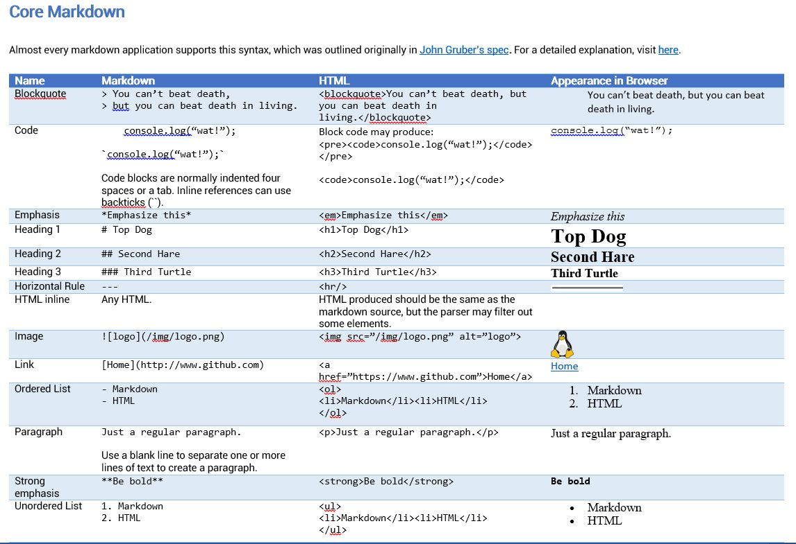
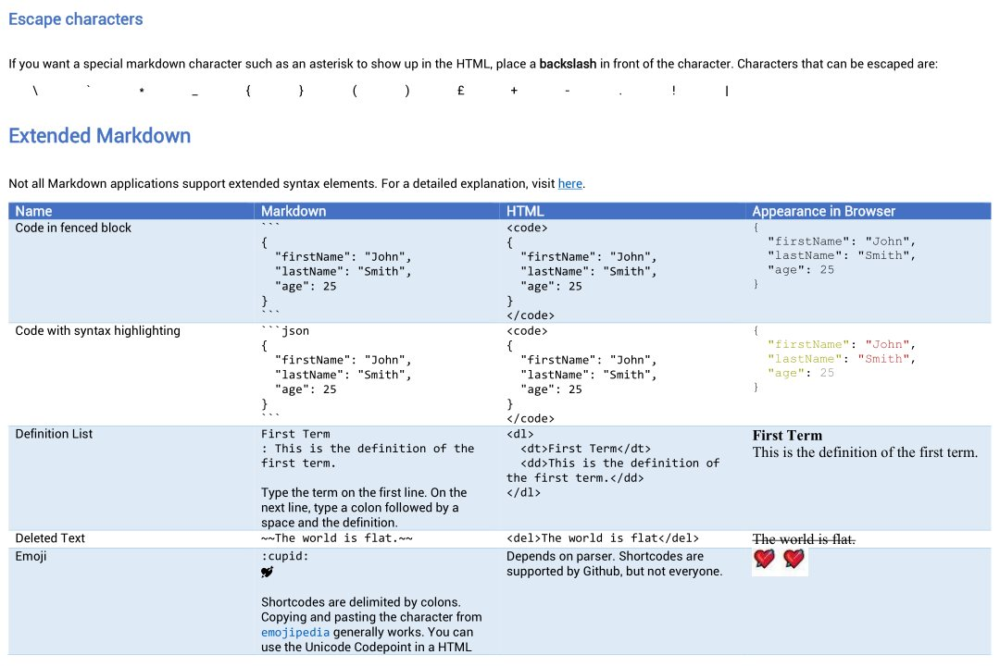

# Markdown Reference

🌟 *Star this repository if it was helpful to you.*

This is a comprehensive and succint reference for markdown. Its includes the following:

1. **Cheatsheet**: `Markdown Cheatsheet.docx` is formatted as below, `Markdown Cheatsheet.pdf` is a converted PDF version.

1. **Complete reference**: A more detailed look into all things markdown can be found in the [repository wiki](https://github.com/robole/markdown-cheatsheet/wiki). This has the same content as `markdown.md`. 
1. **Test file**: `Test.md` has all of the snippets from the cheatsheet, and more, if you want to test how an application handles the different features of (extended) markdown. 
1. **Extended Markdown Application Support**: `Extended Markdown Application Support.xlsx` shows which extended markdown features are supported by some applications such as: Atom, Notepad++, Github, and Visual Code Studio. This is inside the cheatsheet as a table also.

