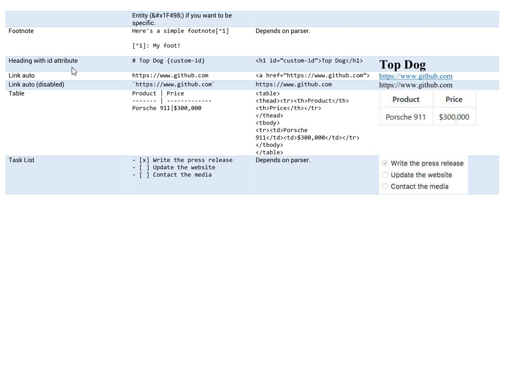
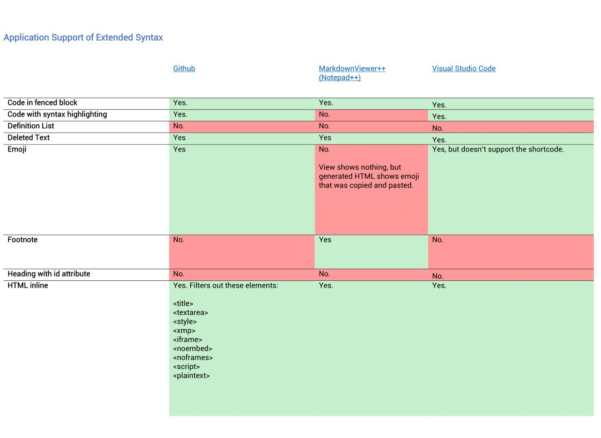

# Markdown Cheatsheet

This is a comprehensive and succint cheatsheet for markdown. 

Over time I noticed some inconsistencies when I was using markdown in different applications, and on different platforms. It irked me, and I wanted to know what the real f-ing standard is!

`Markdown Cheatsheet.pdf` is created from the well-formatted `Markdown Cheatsheet.docx`, you can edit that yourself if you want to create a more personal style!

More depth is gone into in the [repository wiki](https://github.com/robole/markdown-cheatsheet/wiki), which is the same text as `markdown.md`. 

There is a `test.md` that has all of the snippets from the cheatsheet, and more, if you want to test how an application handles markdown.